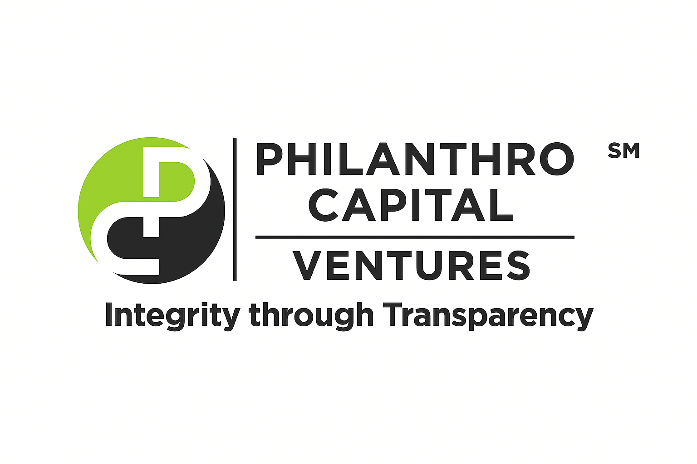

  

## 📑 table of contents
- [🌍 mission](#-mission)
- [🔗 features](#-features)
- [🧠 repository structure](#-repository-structure)
- [🤝 contributing](#-contributing)
- [🧾 license](#-license)
- [🛡️ security](#-security)
- [🧩 governance & access policies](#-governance--access-policies)
- [📬 contact](#-contact)
- [🪙 support transparent philanthropy](#-support-transparent-philanthropy)
- [🔮 next steps](#-next-steps)

# philanthro capital ventures transparency platform

**open-source blockchain transparency framework** built by **philanthro capital ventures (pcv)** to bring *integrity through transparency* to global philanthropy.

pcv merges blockchain technology with charitable giving to enable donors, nonprofits, and innovators to verify every transaction — from donation to impact — in real time.

---

## 🌍 mission

philanthro capital ventures (pcv) is dedicated to building **integrity through transparency** by merging blockchain technology with philanthropy.  

our mission is to **develop, assist, and promote beneficial change** across community-based opportunities — including **disaster preparedness, education, health and human services, and the arts** — through open-source transparency tools that make every transaction traceable, verifiable, and accountable.

---

## 🔗 features

- transparent donation tracking on-chain (eth, usdc, usdt, matic, btc)  
- smart contract-based proof of allocation  
- real-time blockchain audit trail for charitable spending  
- dao-ready framework for governance and reporting  
- fully open-source and community-auditable infrastructure  

---

## 🧠 repository structure

pcv-transparency-platform/
│
├── pcv_logo.png
├── pcv_wordcloud.png
├── pcv_pitchdeck.pdf
├── philanthro_capital_ventures_white_paper.pdf
├── founder_statement_pcv.pdf
├── intel_memory_bottleneck_and_rambus_legacy.pdf
├── rambus_and_my_mission_journey_pcv.pdf
├── fraud_example_long_beach_food_bank.pdf
│
├── readme.md                 ← you are here
├── contributing.md           ← collaboration guidelines
├── code_of_conduct.md        ← community standards
├── license                   ← legal license (mit)
└── security.md               ← responsible disclosure process

---

## 🤝 contributing

we welcome developers, auditors, and transparency advocates to collaborate.  
please review the following before contributing:

- [`contributing.md`](./contributing.md)  
- [`code_of_conduct.md`](./code_of_conduct.md)

---

## 🧾 license

this project is licensed under the mit license.  
see the [`license`](./license) file for details.

---

## 🛡️ security

if you discover a security vulnerability or data risk, please refer to  
[`security.md`](./security.md) for our responsible disclosure process.

---

➡️ learn more in our [mission, vision & values](./mission_vision_values.md) statement.

## 🧩 governance & access policies

---

- [`contributors_access_policy.md`](./contributors_access_policy.md) — defines contributor permissions  
- [`repository_governance_policy.md`](./repository_governance_policy.md) — outlines decision-making & structure  
- [`notice`](./notice) — legal attributions and notices

---

## 📬 contact  

**philanthro capital ventures**  
woodland hills, ca 91364  
🌐 [philcapventures.org](https://philcapventures.org)  
📧 [info@philcapventures.org](mailto:info@philcapventures.org)  
🐦 [@philcapventures](https://x.com/philcapventures)  
💼 [linkedin: gary morris](https://www.linkedin.com/in/gary-morris-19b67219/)  

---

## 🪙 support transparent philanthropy

every transaction is viewable on-chain through our blockchain donation wallet.  
to support our mission, you can donate in:  
**eth, usdc, usdt, matic, or btc.**

---

## 🧠 repository structure

for an overview of all project files and documents, visit the [docs directory](./docs/)  
or see key governance files below:

- [`mission_vision_values.md`](./mission_vision_values.md) – organizational foundation  
- [`contributing.md`](./contributing.md) – collaboration guidelines  
- [`code_of_conduct.md`](./code_of_conduct.md) – community standards  
- [`contributors_access_policy.md`](./contributors_access_policy.md) – contributor permissions  
- [`repository_governance_policy.md`](./repository_governance_policy.md) – governance structure  
- [`license`](./license) – legal license (mit)  
- [`security.md`](./security.md) – responsible disclosure  
- [`notice`](./notice) – legal attributions  

---

## 🔮 next steps

- add `roadmap.md` for development milestones and partnerships  
- publish `/docs/readme.md` to organize your whitepapers & pdfs  
- begin transparent wallet tracking for pcv on-chain donations

---

> “philanthro capital ventures represents a new era of philanthropy — enabling communities worldwide to give confidently and see measurable results.”
